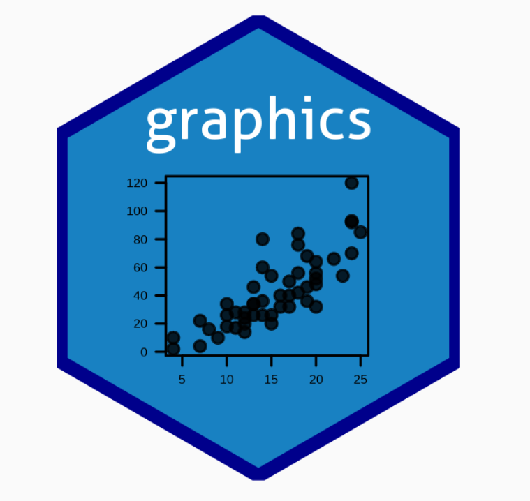
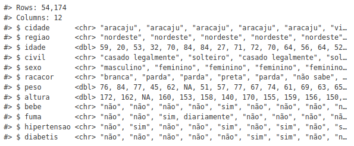
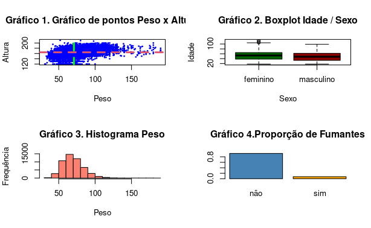

# Visualização de dados de interesse para a vigilância em saúde - Edição 2


<div align="center">
    <div style="display: flex; align-items: center;">
        
    </div>
</div>

<br> 
A visualização de dados na vigilância em saúde deve ser clara e objetiva. Gráficos de linha mostram tendências, barras comparam distribuições e mapas destacam surtos geoespaciais. A escolha do gráfico depende da variável analisada e da mensagem a ser transmitida.

### 1. O uso de gráfico na vigilância em saúde

Gráficos são representações visuais de dados mensuráveis ou quantificáveis, facilitando a análise e interpretação dos resultados. Normalmente, os dados são inicialmente organizados em tabelas para análise estatística, e, a partir delas, utilizam-se ferramentas para apresentar e interpretar os resultados, especialmente na vigilância em saúde.

Ferramentas como o **Microsoft Excel, Epi Info e Tabwin** já são comuns para a visualização de dados na área de saúde. No entanto, à medida que o volume e a complexidade dos dados aumentam, essas ferramentas se tornam limitadas. O uso da linguagem de programação R oferece maior praticidade, especialmente para grandes volumes de dados, permitindo a automação e uma vasta gama de gráficos, tornando a interpretação da informação mais clara e precisa.

Como parte deste projeto de aprendizado, serão explorados diversos tipos de gráficos, como gráficos de c**oluna, barras, pizza, área, linha, pirâmides etárias, entre outros gráficos interativos**. A ênfase será em como escolher o gráfico mais adequado para cada tipo de análise. Utilizando pacotes como o módulo base do R e o **ggplot2**, que faz parte do metapacote tidyverse, será possível acessar uma ampla gama de possibilidades para criar gráficos atraentes e eficazes.

### 1.1 Preparando os dados

Um dos maiores benefícios da linguagem de programação R é a facilidade na estruturação de dados e organização das rotinas para análise na vigilância em saúde. Bases de dados, como a do Sinan Net, podem ser facilmente importadas e, com isso, é possível criar scripts para elaborar gráficos com alta qualidade visual, que podem ser automatizados e replicados.

Neste projeto de aprendizado, vamos utilizar a base de dados do **VIGITEL 2015**(Vigilância de Fatores de Risco e Proteção para Doenças Crônicas por Inquérito Telefônico), um sistema de Vigilância de Fatores de Risco para Doenças Crônicas Não Transmissíveis (DCNT) do Ministério da Saúde. Selecionaremos algumas variáveis do inquérito para explorar os recursos gráficos do R.

Para começar, você precisará importar o banco de dados VIGITEL 2015 usando a função **read_csv2()** do **pacote readr**, que faz parte do metapacote tidyverse. O código para isso será fornecido para você replicar no RStudio, garantindo que o processo de importação e manipulação de dados seja eficiente e prático.


```R
if(!require(tidyverse)) install.packages("tidyverse");library(tidyverse)

```

Aqui está o que ele faz:

1.  **if(!require(tidyverse)):**

*   O **require()**tenta carregar o pacote tidyverse.

*   O operador ! nega o resultado, ou seja, !require(tidyverse) será TRUE se o pacote não estiver carregado.

*   Se o pacote não estiver carregado, o código dentro do bloco if será executado.

2.  **install.packages("tidyverse"):**

*   O **install.packages()** é a função que baixa e instala pacotes do repositório CRAN do R.

3.  **library(tidyverse):**

*   Depois que o pacote é instalado (se necessário), a função library(tidyverse) carrega o pacote para a sessão atual, permitindo que você use as funções e recursos disponíveis nele.

```R
# Importando o banco de dados {`vigitel_2015.csv`}
# e armazenando os dados no objeto `vigitel`
vigitel <- read_csv2('/home/pamela/Documentos/r-data-viz/Dados/vigitel_2015.csv')
```

Os dados estão armazenados no objeto {vigitel} e analisaremos a estrutura do banco de dados utilizando a função glimpse() do pacote dplyr. Perceba que o objeto {vigitel} contém 12 colunas (variáveis) e 54.174 linhas (observações) individuais.

```R 
# Visualizando a estrutura do objeto {`vigitel`}
glimpse(vigitel)
```

<div align="center">
    <div style="display: flex; align-items: center;">
        
    </div>
</div>

A variável fuma contém três categorias de respostas (“não”, “sim, diariamente” e “sim, mas não diariamente”) que, para nossos exemplos, vamos categorizar para apenas duas (“sim” e “não”). Para isso, vamos utilizar a função if_else(), aninhada à função mutate(), ambas do pacote dplyr. Com essa função, vamos definir que se a variável for igual a “não”, substitua para “não” e, caso contrário, substitua para “sim”. É uma operação simples de transformação. 


```R 
vigitel <- vigitel |> 
  
  # Transformando os valores da coluna "fuma" para "sim" e "não" apenas
  mutate(fuma = if_else(fuma == "não", "não", "sim"))
```


### 1.2 Utilizando a função plot()

O módulo base do R é útil para criar gráficos simples de forma rápida, sem necessidade de pacotes adicionais. Ele é ideal para visualizar dados com poucos comandos, como gráficos de linhas, barras e boxplots. A função **plot()** é a principal ferramenta gráfica, permitindo uma análise rápida com muitos recursos gráficos.

**Argumentos básicos da função plot():**

*   **x**: Dados para o eixo x.

*   **y**: Dados para o eixo y (opcional).

Outros argumentos úteis:

*   **type**: Define o tipo de gráfico, como "p" (pontos), "l" (linhas) e "b" (pontos e linhas).

*   **pch**: Define a forma dos pontos (como quadrado ou triângulo).

*   **col**: Cor dos símbolos e linhas.

*   **cex**: Tamanho de texto e símbolos.

*   **main**: Título do gráfico.

*   **xlab e ylab**: Títulos dos eixos x e y.

*   **lty**: Tipo de linha (sólida, tracejada ou pontilhada).

*   **lwd**: Espessura da linha.

A função **par()** com o argumento mfrow pode ser usada para organizar múltiplos gráficos na mesma tela. Por exemplo, **par(mfrow = c(2, 2))** cria uma matriz de 2 linhas e 2 colunas para exibir quatro gráficos.

Essa abordagem permite criar gráficos como pontos, boxplot, histograma e barras de maneira simples e eficaz.

[Script do Codigo do Grafico plot()](https://github.com/pamelamontteiro/r-data-viz/blob/main/src/visualizacao_graficos.R)

<div align="center">
    <div style="display: flex; align-items: center;">
        
    </div>
</div>

<br>
No exemplo apresentado, são exibidos quatro tipos de gráficos comuns na análise de dados:

1.  **Gráfico de pontos**: Mostra o cruzamento entre as variáveis peso e altura, com linhas tracejadas indicando as médias de peso (linha verde) e altura (linha vermelha) nos eixos x e y, respectivamente. As linhas são desenhadas com a função **abline()** e a média é calculada com **mean()**.

2.  **Gráfico boxplot**: Exibe a relação entre a variável categórica sexo e a variável numérica idade, utilizando o operador ~. As cores das categorias são definidas por um vetor de cores.

3.  **Histograma**: Mostra a distribuição da variável peso. O histograma é útil para visualizar a frequência de dados em diferentes intervalos.

4.  **Gráfico de barras**: Exibe a proporção de fumantes, utilizando cores definidas por um vetor de cores que corresponde às categorias da variável.

Esses gráficos são amplamente usados na análise de dados e podem ser rapidamente gerados com o R. A próxima etapa envolve personalizações gráficas mais detalhadas, com foco no uso de cores, um elemento crucial na visualização de dados.


